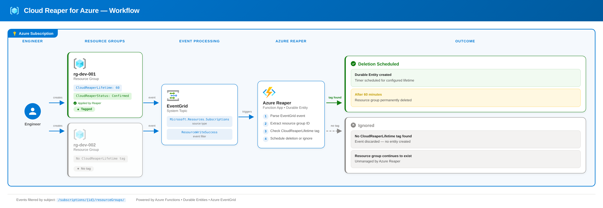
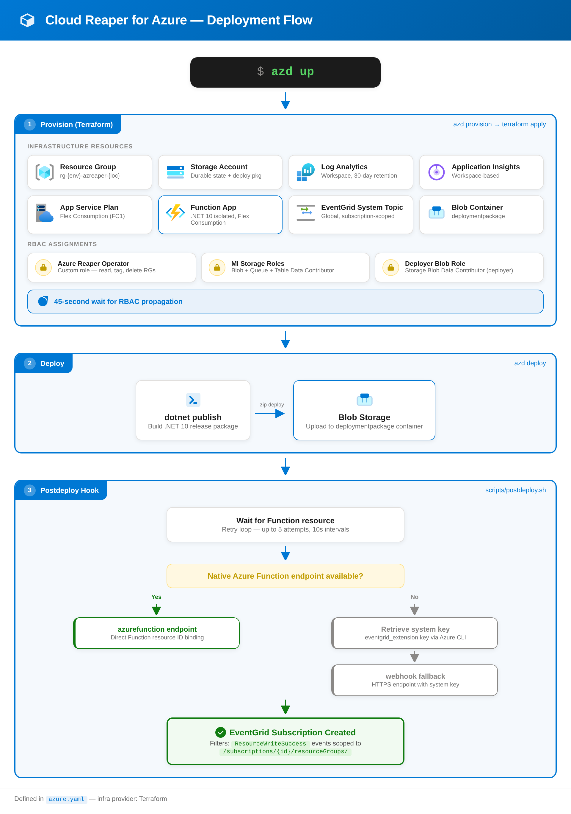

<p><a target="_blank" href="https://app.eraser.io/workspace/l4XQEUndY4eCyx0QUlsY" id="edit-in-eraser-github-link"></a></p>

[](https://sonarcloud.io/summary/new_code?id=lrottach_az-reaper)


# Azure Reaper
**In the age-old dance of creation and destruction, behold Azure Reaper, a guardian wrought in code and cloud. Its purpose noble, it wields the power to vanquish Azure resources marked by time’s decree, ensuring realms of development and testing stand uncluttered, their legacies preserved in the annals of digital lore.**

>  [!IMPORTANT]
Please note that Azure Reaper is currently undergoing a major rewrite to leverage the latest .NET and Azure Functions frameworks. The version available on the main branch is under active development and may be unstable. For those interested in the previous stable version, it can be found in the ./archive directory of this repository. I appreciate your interest and patience as I am working to improve the capabilities and performance of Azure Reaper.

Azure Reaper is a automation tool built on the robust foundation of Azure Functions to streamline the management of your cloud environment. This solution specializes in automatically deleting groups of resources tagged to your specifications, making it ideal for development and test environments. With Azure Reaper, you not only save money by eliminating unnecessary resource sprawl, but you also reduce the burden of manual cleanup. Leverage this seamless integration into your workflow to increase efficiency, reduce costs, and maintain a focused, clutter-free cloud environment.
The idea is based on Jeff Holan's great [functions-csharp-entities-grimreaper](https://github.com/jeffhollan/functions-csharp-entities-grimreaper), rewritten in a more simple form without the Twilio SMS part.

## Architecture


## Tags
Azure Reaper uses specific tags to manage the lifecycle of Azure resource groups. Tag names are configurable via environment variables (`LifetimeTagName`, `StatusTagName`). Below are the default tags and their use cases:

| Tag Name | Description | Example Value | Responsibility | Comments |
| ----- | ----- | ----- | ----- | ----- |
| CloudReaperLifetime | This tag is applied when the resource group is created by the engineer. It specifies the lifespan of the resource group in minutes before it should be deleted. The value must be a positive integer (> 0). Values of 0, negative numbers, or non-integer strings are ignored. Configurable via `LifetimeTagName`. | 60 (for 60 minutes lifetime) | User |  |
| CloudReaperStatus | This tag is applied by Azure Reaper after successful validation and scheduling of the resource group’s deletion. It indicates that the resource group is confirmed for deletion. Configurable via `StatusTagName`. | Confirmed | Azure Reaper | Can be used to return comments or error messages from Azure Reaper |
| CloudReaperDeletionTime | Could be used to message back the exact time and date of the scheduled death. | 2024-05-31T15:30:00Z | Azure Reaper | Not yet implmeneted! |
## Limitations
Azure Reaper currently has the following limitations:

| Description | Status |
| ----- | ----- |
| It is not possible to stop the deletion of a scheduled resource group. 😅 However, a lock can be applied to prevent deletion. | ✅ Workaround Available |
| Azure Reaper has only been tested with a single subscription. Multi-subscription support is planned. | 🔨 Planned Improvement |
| Azure Reaper operates only at the Azure Resource Group level, not on individual resources | 🗒️ Current Functionality |
| These limitations will be actively addressed in future updates to help make Azure Reaper work and play better. |  |
## Status
Azure Reaper is under active development and is constantly evolving. The capabilities and performance of the project are continually being improved.

# Deployment guide



> [!WARNING]
> Azure Reaper uses a custom role that grants its managed identity permission to read, modify tags on, and **delete** any resource group in the target subscription. While this role is scoped to resource group lifecycle operations only, it is still highly privileged. Deployment is recommended for **test and development subscriptions only**. Do not deploy to production subscriptions without a thorough security review.

Azure Reaper is deployed with Azure Developer CLI (`azd`) and Terraform.

## Prerequisites

### Required permissions
The user running the deployment needs the following permissions on the target Azure subscription:

| Permission | Reason |
| ----- | ----- |
| **Owner** (or Contributor + User Access Administrator) | The deployment creates a custom role definition and role assignments, which requires `Microsoft.Authorization/roleAssignments/write` and `Microsoft.Authorization/roleDefinitions/write`. |
| Resource provider registration | The `Microsoft.EventGrid` resource provider must be registered on the subscription (see tip below). |

During provisioning, the deployment creates a custom **Azure Reaper Operator** role with least-privilege permissions (read, tag, and delete resource groups only) and assigns it to the Function App's system-assigned managed identity. Storage access uses managed identity authentication — no connection strings or access keys are stored in app settings.

For the current dev/test setup, Terraform also auto-grants the **currently authenticated deployer principal** `Storage Blob Data Contributor` on the deployment storage account. This is needed because `azd deploy` uploads the function package to Blob Storage by using Azure AD data-plane access, and subscription-level Owner/Contributor rights alone are not sufficient for that upload.

### Required tooling

1. Install the required tooling: `az`, `azd`, `dotnet` 10, and Azure Functions Core Tools 4.x.
2. Sign in to Azure:
   ```bash
   az login
   azd auth login
   ```
3. Create or select an `azd` environment and choose a short environment name such as `d1`:
   ```bash
   azd env new d1
   azd env set AZURE_LOCATION westeurope
   ```
4. Run the deployment:
   ```bash
   azd up
   ```

`azd up` provisions the infrastructure, waits briefly for the deployer's Blob role assignment to propagate, deploys the Function App package, and then runs `scripts/postdeploy.sh` to create or update the Event Grid subscription.

> [!TIP]
> If provisioning fails with a `MissingSubscriptionRegistration` error for `Microsoft.EventGrid`, register the resource provider first:
> ```bash
> az provider register --namespace Microsoft.EventGrid
> az provider show --namespace Microsoft.EventGrid --query "registrationState" -o tsv
> ```
> Wait until the state shows `Registered`, then re-run `azd up`.

> [!NOTE]
> The repository includes `infra/main.tfvars.json` because `azd` expects that parameter template for Terraform projects. It passes the core `AZURE_*` values into Terraform, while optional naming overrides still come from `azd env set TF_VAR_<name> ...`.

By default, resource names are generated from `AZURE_ENV_NAME` and `AZURE_LOCATION` using the pattern `<prefix>-<env>-azreaper-<location>`, for example `rg-d1-azreaper-westeurope`. For generated defaults, Terraform lowercases those inputs and replaces non-alphanumeric characters with `-`. The storage account uses the same inputs but removes non-alphanumeric characters entirely so the final name stays within Azure's lowercase alphanumeric 3-24 character rule.

> [!NOTE]
> If your environment name is too generic or common, the derived storage account name may already be taken globally. In that case, provisioning will fail. Use a more unique environment name or override the storage account name with `azd env set TF_VAR_storage_account_name <unique-name>`.

You can still bring your own names by setting Terraform override variables in the `azd` environment before running `azd up`:

```bash
azd env set TF_VAR_resource_group_name rg-custom-reaper
azd env set TF_VAR_storage_account_name std1azreaperweu
azd env set TF_VAR_function_app_name func-custom-reaper
azd env set TF_VAR_app_service_plan_name asp-custom-reaper
azd env set TF_VAR_log_analytics_name log-custom-reaper
azd env set TF_VAR_app_insights_name appi-custom-reaper
azd env set TF_VAR_eventgrid_system_topic_name evgt-custom-reaper
azd env set TF_VAR_eventgrid_event_subscription_name evs-custom-reaper
```

After infrastructure provisioning, `azd` deploys the Function App and runs the postdeploy hook to create or update the Event Grid event subscription. The hook first tries to target the `EventGridTrigger` function by its Azure resource ID. If that native Function endpoint is not accepted yet on the hosting plan or platform, the hook falls back to the Event Grid webhook endpoint using the Function's Event Grid system key.

If a different user or CI identity later runs `azd deploy` against the same environment, that identity must also have `Storage Blob Data Contributor` on the deployment storage account. The current auto-grant behavior is a convenience for this repository's dev/test workflow and should be reviewed before reusing the template in stricter production environments.

## Deprovisioning

To remove all Azure resources created by this deployment:

```bash
azd down
```

> [!NOTE]
> The Terraform provider is configured with `prevent_deletion_if_contains_resources = false`. This means `azd down` will delete the resource group and all its contents, including resources not directly managed by Terraform (e.g., the smart detection alert rule auto-created by Application Insights). This is intentional for this self-contained project but should be reviewed if the template is reused in shared environments.


<!--- Eraser file: https://app.eraser.io/workspace/l4XQEUndY4eCyx0QUlsY --->
